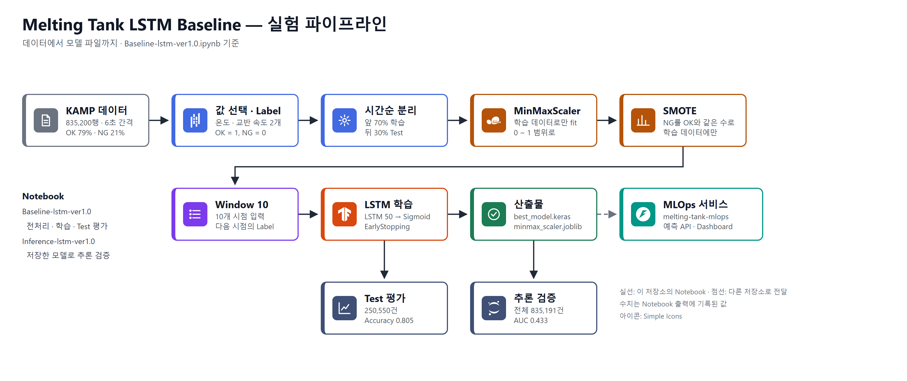
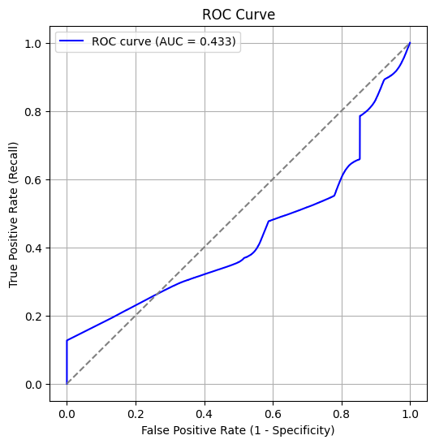
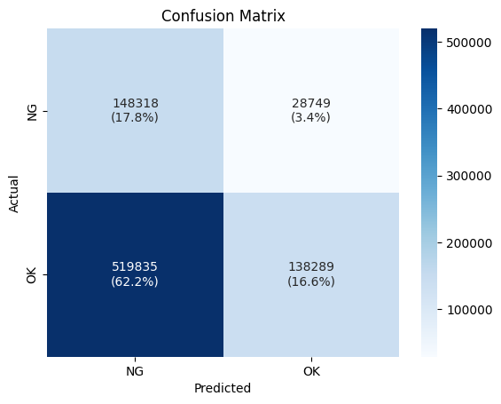
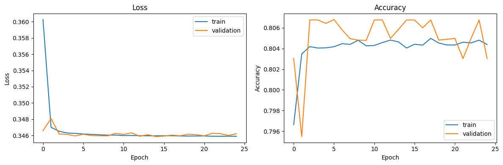

# Melting Tank LSTM Baseline

**용해탱크 공정의 센서 값으로 제품의 정상(OK) / 불량(NG)을 예측하는 LSTM Baseline 실험**

최근 10개 시점의 용해 온도와 교반 속도를 넣으면 다음 시점의 제품이 정상일 확률을 출력하는 모델을 만들고 평가했습니다.
여기서 만든 모델 파일은 [melting-tank-mlops](https://github.com/youneedpython/melting-tank-mlops)의 예측 API가 사용합니다.



> Baseline 실험 기록입니다. 평가 결과, 이 모델은 정상과 불량을 구분하는 힘이 약합니다. 수치를 읽는 법은 [결과](#결과)에 적었습니다.

| | |
|---|---|
| 데이터 | KAMP 용해탱크 AI 데이터셋, 835,200행 (2020-03-04 ~ 2020-04-30, 6초 간격) |
| 입력 | `MELT_TEMP`(용해 온도), `MOTORSPEED`(교반 속도) × 10개 시점 |
| Label | `TAG`: OK = 1, NG = 0 |
| 모델 | LSTM 50 → Dense 1 (Sigmoid), Parameter 10,651개 |
| 평가 | 뒤쪽 30% 기간을 Test로 사용, Threshold 0.5 |

**더 읽기**: [Wiki](https://github.com/youneedpython/melting-tank-lstm-baseline/wiki) · [melting-tank-mlops (모델을 서비스로 배포)](https://github.com/youneedpython/melting-tank-mlops) · [KAMP 데이터셋](https://www.kamp-ai.kr/)

---

## 결과

### Test 평가 (`Baseline-lstm-ver1.0.ipynb`)

Test 250,550건, 양성 Class는 OK입니다.

| 지표 | 값 |
|---|---|
| Precision | 0.9961 |
| Recall | 0.8057 |
| Accuracy | 0.8049 |
| F1-score | 0.8909 |

| 실제 \ 예측 | NG | OK |
|---|---|---|
| NG (2,940건) | 2,155 | 785 |
| OK (247,610건) | 48,099 | 199,511 |

**이 수치만 보면 좋아 보이지만, 그렇지 않습니다.**

- Test 기간에는 NG가 1.2%(2,940건)뿐입니다. **전부 OK라고만 예측해도 Accuracy가 0.988**이고, 이 모델의 0.805는 그보다 낮습니다.
- Precision 0.996도 같은 이유로 높습니다. OK가 98.8%인 데이터에서는 무엇을 OK라고 해도 대부분 맞습니다.
- NG 기준으로 보면, 실제 NG의 73%(2,155건)를 찾았지만 NG라고 예측한 50,254건 중 실제 NG는 4.3%입니다.

### 전체 데이터로 다시 평가 (`Inference-lstm-ver1.0.ipynb`)

저장한 모델을 불러와 전체 835,191건(학습 기간 포함)을 다시 예측했습니다.

| 항목 | 값 |
|---|---|
| ROC AUC (OK 기준) | 0.433 |
| ROC AUC (확률을 뒤집었을 때) | 0.567 |
| Accuracy (Threshold 0.9) | 0.34 |

<p>
  
  &nbsp;&nbsp;
  
</p>

- AUC 0.5는 무작위 수준입니다. 0.433(뒤집어도 0.567)은 **이 모델이 정상과 불량을 거의 구분하지 못한다**는 뜻입니다.
- Threshold를 바꿔도 의미 있는 기준을 찾지 못했습니다(F1이 가장 높은 Threshold가 0.00).

### 학습 곡선



25 Epoch에서 EarlyStopping으로 멈췄고(가장 좋은 Epoch는 15), Validation Accuracy는 0.807에서 더 오르지 않았습니다.

---

## 실험 내용

### 1. 데이터

- KAMP(중소벤처기업부 · KAIST)가 공개한 용해탱크 데이터셋입니다. 저장소에는 데이터 파일이 없습니다.
- 값 4개(`MELT_TEMP`, `MOTORSPEED`, `MELT_WEIGHT`, `INSP`)와 판정 `TAG`가 있습니다. 결측치는 없습니다.
- OK 658,133건(79%), NG 177,067건(21%)입니다.
- 자세한 값의 범위와 상관분석은 Notebook의 "데이터 특성 파악"에 있습니다.

### 2. 전처리

- 입력으로 `MELT_TEMP`와 `MOTORSPEED` 2개만 사용합니다. `MELT_WEIGHT`(`TAG`와 상관계수 -0.01)와 `INSP`는 쓰지 않습니다.
- 시간 순서대로 앞 70%(584,640행)를 학습, 뒤 30%(250,560행)를 Test로 나눕니다. 섞지 않습니다.
- MinMaxScaler는 학습 데이터로만 맞춥니다.
- 학습 데이터에만 SMOTE를 적용해 NG를 OK와 같은 수(각 410,516건)로 늘립니다.

### 3. 모델과 학습

- 10개 시점을 한 Window로 묶고, Window 바로 다음 시점의 `TAG`를 Label로 씁니다.
- LSTM(50, tanh) → Dense(1, Sigmoid), Loss는 Binary Crossentropy, Optimizer는 Adam입니다.
- Batch 50, 최대 200 Epoch, `val_loss`가 10 Epoch 동안 나아지지 않으면 멈춥니다.
- `val_accuracy`가 가장 높은 모델을 `model/best_model.keras`로 저장합니다.

### 4. 평가

- Test로 Precision, Recall, Accuracy, F1-score와 Confusion Matrix를 계산합니다.
- 별도 Notebook에서 저장한 모델과 Scaler를 불러와 전체 데이터를 다시 예측하고, Threshold 탐색과 ROC Curve를 그립니다.

---

## 실험은 어떻게 설계했나요?

| 단계 | 기준 |
|---|---|
| 입력 Window | 10개 시점(6초 간격, 1분) |
| Label 정의 | `LabelEncoder`의 알파벳 순서: NG = 0, OK = 1. Window 다음 시점의 값 |
| 학습 / Test 분리 | 시간순 70% / 30% (`shuffle=False`) |
| Validation | 학습 Window의 30%를 무작위로 분리 (`random_state=0`) |
| 불균형 처리 | SMOTE (`random_state=0`), 학습 데이터에만 |
| 판정 Threshold | 0.5 이상이면 OK |
| 평가 지표 | Precision, Recall, Accuracy, F1-score (양성 = OK), ROC AUC |

### 설계에서 확인된 한계

- **모델 출력은 정상일 확률입니다.** Label이 OK = 1이기 때문입니다. 이 모델을 쓰는 쪽은 불량 확률을 `1 - 출력`으로 계산해야 합니다.
- **SMOTE를 Window로 묶기 전에 적용했습니다.** SMOTE가 만든 NG 행은 시간 순서가 없는 채로 데이터 끝에 붙습니다. 그 부분에서 만든 Window는 실제 연속 구간이 아닙니다.
- **Validation이 학습과 겹칩니다.** 한 칸씩 밀어 만든 Window를 무작위로 나눠서, Validation의 Window가 학습 Window와 대부분의 시점을 공유합니다.
- **학습 기간과 Test 기간의 NG 비율이 크게 다릅니다.** 학습 30%, Test 1.2%입니다.
- **TensorFlow의 Seed를 고정하지 않았습니다.** 다시 학습하면 수치가 조금 달라집니다. 실제로 `Baseline-lstm.ipynb`(이전 실행)의 결과는 Accuracy 0.8054입니다.

---

## 구성

| Notebook | 역할 | 만드는 것 |
|---|---|---|
| `Baseline-lstm-ver1.0.ipynb` | 데이터 확인, 전처리, 학습, Test 평가 | `model/best_model.keras`, `artifacts/minmax_scaler.joblib`, `artifacts/inference_meta.json`, `checkpoints/` |
| `Inference-lstm-ver1.0.ipynb` | 저장한 모델로 전체 데이터 예측, Threshold 탐색, ROC Curve | 없음 |
| `Baseline-lstm.ipynb` | ver1.0 이전 실행 기록 (구성은 같고 결과 수치가 조금 다름) | 위와 같음 |

모델 파일, Scaler, Checkpoint, 데이터는 `.gitignore`로 제외되어 저장소에 없습니다. 학습한 모델 파일은 [melting-tank-mlops](https://github.com/youneedpython/melting-tank-mlops)의 `model/`과 `artifacts/`에 들어 있습니다.

## 기술 스택

| 영역 | 기술 |
|---|---|
| 모델 | TensorFlow 2.20, Keras 3.12 |
| 전처리 · 평가 | scikit-learn 1.7, imbalanced-learn 0.14, pandas 2.3, NumPy 2.2 |
| 시각화 | Matplotlib 3.10, seaborn |
| 실행 | Jupyter Notebook |

정확한 Version은 `requirements.txt`를 따릅니다. seaborn과 Jupyter Notebook은 `requirements.txt`에 없어 따로 설치해야 합니다.

## 재현 방법

| 항목 | 내용 |
|---|---|
| 데이터 위치 | `data/melting_tank.csv` ([KAMP](https://www.kamp-ai.kr/)에서 내려받아 직접 넣음) |
| 실행 순서 | `Baseline-lstm-ver1.0.ipynb` → `Inference-lstm-ver1.0.ipynb` |
| Seed | SMOTE와 Validation 분리는 `random_state=0`. TensorFlow Seed는 고정하지 않음 |
| 학습 시간 | Epoch당 약 24초, 25 Epoch (Notebook 출력 기준) |

2026-10-06 문서 정리 때 Notebook을 다시 실행하지는 않았습니다. 이 README의 수치는 모두 저장소 Notebook에 남아 있는 출력에서 옮겼습니다.

---

## 시작하기

```bash
pip install -r requirements.txt
pip install seaborn notebook               # requirements.txt에 없는 것: 시각화, Jupyter Notebook
jupyter notebook Baseline-lstm-ver1.0.ipynb
```

실행하기 전에 KAMP에서 받은 데이터를 `data/melting_tank.csv`로 넣어야 합니다.

---

## 프로젝트 구조

```text
melting-tank-lstm-baseline/
├── Baseline-lstm-ver1.0.ipynb     전처리, 학습, Test 평가
├── Inference-lstm-ver1.0.ipynb    저장한 모델로 추론 검증
├── Baseline-lstm.ipynb            이전 실행 기록
├── docs/images/                   README 이미지 (Notebook 출력에서 추출)
├── requirements.txt
└── README.md

실행하면 생기는 폴더 (저장소에는 없음)
├── data/                          KAMP 데이터
├── model/                         best_model.keras
├── artifacts/                     Scaler, 추론 설정
└── checkpoints/                   Epoch별 모델
```

## 데이터 출처

Ministry of SMEs and Startups, and KAIST (Korea Advanced Institute of Science and Technology). (2020, December 14). Melting tank AI dataset. Korea AI Manufacturing Platform (KAMP). https://www.kamp-ai.kr/
